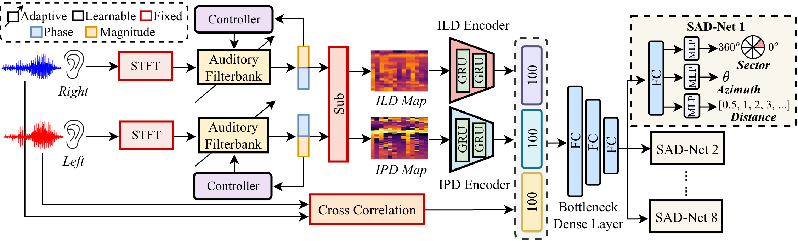
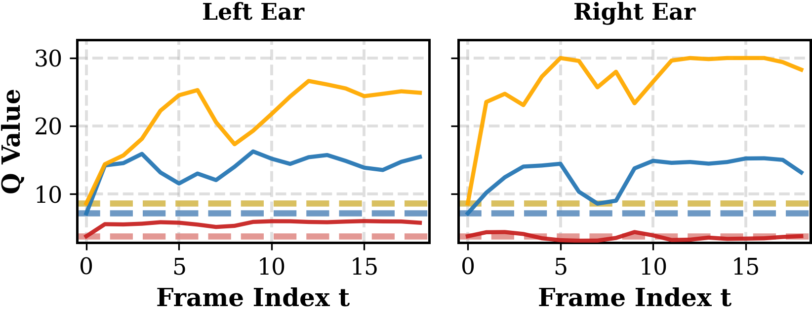

<div align="center">

# BiEAR

### A Human Auditory-Inspired Adaptive Binaural Front-end<br>for Multi-Speaker Localisation and Distance Estimation

**INTERSPEECH 2026**

Hanyu Meng · Eliathamby Ambikairajah · Vidhyasaharan Sethu · Qiquan Zhang · Haizhou Li

<sub>UNSW Sydney · Tongyi Speech Lab, Alibaba Group · The Chinese University of Hong Kong, Shenzhen</sub>


[**Paper**](https://arxiv.org/abs/2606.06795) &nbsp; / &nbsp;
[**Getting started**](#getting-started) &nbsp; / &nbsp;
[**Results**](docs/results.md) &nbsp; / &nbsp;
[**Citation**](#citation)

</div>

**BiEAR adapts how it listens.** Inspired by auditory efferent feedback, its binaural front-end adjusts filter selectivity for each ear, frequency band and time frame. A shared prediction network estimates source activity, azimuth and distance for multiple speakers.

<p align="center">
  
</p>
<p align="center"><sub>Filter Q adapts to the input during inference. The trained network weights remain fixed.</sub></p>

## How it works

- **Adaptive listening.** Ear-specific controllers use current and smoothed subband levels to regulate filter Q, with absolute or relative modulation.
- **Binaural cues.** Interaural level and phase differences (ILD/IPD) combine with raw-waveform cross-correlation in a 300-dimensional representation.
- **Spatial prediction.** Eight 45° sectors cover the horizontal plane. Each sector predicts source activity, azimuth and a distance class.

<details>
<summary><strong>See how filter Q changes over time</strong></summary>

<p align="center">
  
</p>

Example from the paper presentation. Solid lines show adaptive Q; dashed lines show passive Q. Red, blue and yellow correspond to 159 Hz, 821 Hz and 3.86 kHz. The two ears adapt differently to the same acoustic scene.

</details>

## Selected results

**Three unseen speakers in anechoic conditions.** BiEAR uses dual controllers with relative Q modulation. Bold marks the best value in each column.

| Front-end | Detection accuracy ↑ | Azimuth MAE ↓ | Distance accuracy ↑ |
| :--- | ---: | ---: | ---: |
| DeepEar | 88.62% | 10.40° | 72.01% |
| AuralNet | 88.90% | 9.45° | **74.78%** |
| **BiEAR** | **90.72%** | **8.18°** | 73.65% |

Across the 12 real-room test conditions, BiEAR achieves the lowest azimuth error in all 12. See [full comparisons, evaluation conditions and room adaptation results](docs/results.md).

## Getting started

```bash
git clone https://github.com/Hanyu-Meng/BiEAR.git
cd BiEAR
```

Start with the [setup and reproduction guide](docs/reproduction.md) for dependencies, datasets, H5 formats, training and evaluation. The [configuration reference](docs/configuration.md) explains model variants and experiment settings.

> **Release status:** The model, training/evaluation scripts and data-generation code are included. Full reproduction still requires missing helper modules and an aligned H5 preparation pipeline. Read the [current release notes](docs/reproduction.md#current-release-notes) before running an experiment. Datasets and pretrained checkpoints are not bundled.

## Code guide

| Entry | Purpose |
| :--- | :--- |
| [`model_torch.py`](model_torch.py) | Adaptive filterbanks, binaural encoders and prediction networks |
| [`train_biear.py`](train_biear.py) / [`train_biear_single_ctrl.py`](train_biear_single_ctrl.py) | Dual-controller and shared-controller training |
| [`evaluate_biear.py`](evaluate_biear.py) | Overall and per-speaker-count evaluation |
| [`data.py`](data.py) / [`create_h5_data/`](create_h5_data/) | H5 readers and dataset preparation |
| [`binaural_data_generation/`](binaural_data_generation/) | TIMIT + KEMAR synthesis for anechoic and real-room scenes |
| [`conf/`](conf/) | Experiment configurations |
| [`plots/`](plots/) | Q trajectories, filter responses and feature visualisations |

## Citation

If you use BiEAR in your research, please cite the paper:

```bibtex
@article{meng2026biear,
  title   = {{BiEAR}: A Human Auditory-Inspired Adaptive Binaural Front-end
             for Multi-Speaker Localisation and Distance Estimation},
  author  = {Meng, Hanyu and Ambikairajah, Eliathamby and Sethu, Vidhyasaharan
             and Zhang, Qiquan and Li, Haizhou},
  journal = {arXiv preprint arXiv:2606.06795},
  year    = {2026},
  doi     = {10.48550/arXiv.2606.06795},
  url     = {https://arxiv.org/abs/2606.06795}
}
```

Accepted to INTERSPEECH 2026. The citation above links to the public arXiv version.

## Acknowledgements

Supported by the Australian Research Council (DP210101228) and a UNSW Sydney PhD scholarship. We thank Qiang Yang for providing the DeepEar training and test data, and ASSTA for the New Researcher Award supporting conference attendance.

For questions about the code, please [open an issue](https://github.com/Hanyu-Meng/BiEAR/issues).
