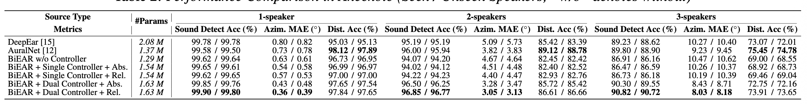
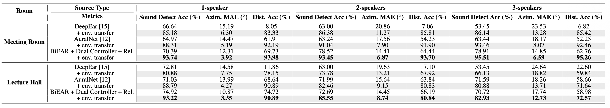

# Results

[Back to BiEAR](../README.md)

These are reported research results from the [BiEAR paper](https://arxiv.org/abs/2606.06795) and its conference presentation. They are not measurements from a fresh run of this repository.

## Anechoic evaluation

The table below selects **unseen speakers** from the full comparison. BiEAR uses **dual controllers with relative Q modulation**. Higher detection/distance accuracy and lower azimuth mean absolute error (MAE) are better. Bold marks the best value for each speaker count and metric.

| Speakers | Front-end | Detection accuracy (%) ↑ | Azimuth MAE (°) ↓ | Distance accuracy (%) ↑ |
| ---: | :--- | ---: | ---: | ---: |
| 1 | DeepEar | 99.78 | 0.82 | 95.13 |
| 1 | AuralNet | 99.50 | 0.78 | **97.89** |
| 1 | **BiEAR** | **99.80** | **0.39** | 97.65 |
| 2 | DeepEar | 95.19 | 5.73 | 83.39 |
| 2 | AuralNet | 95.94 | 3.83 | **88.78** |
| 2 | **BiEAR** | **96.77** | **3.13** | 86.66 |
| 3 | DeepEar | 88.62 | 10.40 | 72.01 |
| 3 | AuralNet | 88.90 | 9.45 | **74.78** |
| 3 | **BiEAR** | **90.72** | **8.18** | 73.65 |

BiEAR has the highest detection accuracy and lowest azimuth error for all three speaker counts. AuralNet has the highest distance accuracy in this anechoic comparison.

Full table, including seen speakers and controller ablations

The original table includes passive BiEAR and shared/dual controllers with absolute/relative Q modulation. Values are **seen / unseen speakers**. Parameter counts refer to the models in this reported comparison.

## Transfer to real rooms

Models trained in anechoic conditions are evaluated in a meeting room and a lecture hall, with unseen speakers. Environment transfer fine-tunes the model on 10% of the room data for 20 epochs and evaluates on the remaining 90%.

Across **2 rooms × 3 speaker counts × 2 transfer settings = 12 conditions**, BiEAR achieves:

- Lowest azimuth MAE in **12/12** conditions.
- Best or tied distance accuracy in **12/12** conditions.
- Best detection accuracy in **11/12** conditions.

### Three-speaker azimuth error

| Room | Before environment transfer | After environment transfer |
| :--- | ---: | ---: |
| Meeting room | 14.85° | 6.59° |
| Lecture hall | 17.74° | 12.73° |

These values use BiEAR with dual controllers and relative Q modulation. Fine-tuning updates model weights; the frame-wise Q adaptation inside BiEAR also operates during inference.

Full real-room comparison

## Experimental context

- TIMIT speech, 1-second binaural mixtures, 1–3 speakers.
- Measured TU Berlin KEMAR HRIRs/BRIRs for anechoic, meeting-room and lecture-hall conditions.
- 72,000 anechoic training examples; 9,000 examples per validation/test split and per real-room test set.
- Eight 45° sectors. The presentation defines five distance classes: 0.5 m, 1 m, 2 m, 3 m and other (>3 m).

The checked-in scripts and configuration files have differences from the reported experimental setup, including label conventions, training settings and checkpoint selection. Consult the [release notes](reproduction.md#current-release-notes) before using the code to reproduce these tables.

## Figure sources

The figures in `docs/assets/` are original assets extracted from the author's BiEAR conference presentation (`Mon_1220_C2.1_HanyuMeng_v1.pptx`): architecture (slide 9), Q trajectories (slide 16), anechoic comparison (slide 14) and room comparison (slide 15). The numeric tables above transcribe those comparison tables.
